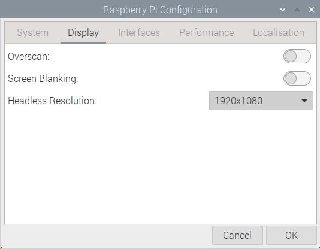

# Raspberry Pi-4 Node

> _Don't worry, setting up a regular node is easy -_ Nobody (2022)


## Introduction

At Revelar, we very quickly realized we needed to have some kind of development sandbox to write and test on-chain code. Being that we're also a bunch of hardware nerds, we decided to build a 3 Pi cluster and add RGB. \
As we went through the process of setting up a Cardano node, we encountered a lot of difficulty mostly because all of the information for our use case, was fragmented and spread out everywhere. \
So this guide presents all the information needed to setup a cardano-node on a Pi 4 to create a development platform.

So if you are looking for a guide to setup a Cardano node on a Raspbian based Pi 4 for the purpose of doing development or _cardano-cli_ tasks, then this is the right guide.

## Catalyst Proposal Corrections

The stuff that we changed from our proposal we put here.

## Hardware Prerequisites

* Raspberry Pi 4 8GB 64-bit
* Heat-sink with a fan ([Something like this](https://www.amazon.com/Raspberry-Armor-Metal-Aluminium-Heatsink/dp/B07VWM4J4L))
* Type C Power Supply
* NVME M.2 SSD with at least 256gb
* NVME M.2 to USB3.0 Case
* Ethernet Cable (If not using wifi)
* Computer Mouse, Keyboard and monitor


As of the date of writing, we have only created a node on a Raspberry Pi 4 with 8GB of RAM. Most literature online will also advise you to use an 8GB Pi so we suggest you also get an 8GB version.

You also REQUIRE a heatsink for the Raspberry Pi. One of the steps in this tutorial overclocks the Pi and for that you do NEED a heatsink. We recommend a single piece unit with an integrated fan.



We recommend that you get an NVME SSD as it greatly increases the speed of storage


## OS Setup

Before we can do anything we first need to setup the operating system on our Raspberry Pi 4. There are many ways to go about this, for simplicity's sake, we just went with the standard Raspbian OS.

### Download the Raspberry Pi Imager

This is the tool we will use to load an operating system onto the Pi. This tool can be downloaded from [raspberrypi.com](https://www.raspberrypi.com/software/).&#x20;

### Download Raspberry Pi OS 64-bit

In this guide, we will use the standard Raspberry Pi OS. The OS can be downloaded from the official site.


Raspberry Pi OS Download Location


Scroll down on the website and download the `Raspberry Pi OS with Desktop.` The picture below shows the latest version as at the time of writing. You may need to download a newer version if it is available.


Once downloaded, extract the file into an empty folder. You should now have a disc image file in that file titled something like `2022-01-28-raspios-bullseye-arm64.img`.

### Flash the OS

Now connect your NVME SSD via USB and open Raspberry Pi Imager.&#x20;


The Imager will have three options to choose from. Under _Operating System,_ scroll down the list and choose the `Use Custom` option. In the popup navigate to the Disc Image file we downloaded in the previous step.


Next, select the name of your drive under the Storage option. Lastly click on _Write_ to start the process of writing an OS to the SSD. You will be asked to erase all data on disk to which you must say Yes.&#x20;

Now you just wait for the process to complete. It usually takes a couple of minutes.

## Raspberry Pi Setup

Once you have loaded an OS, you are ready to start with booting up your Pi. For the first time, you will require a keyboard, mouse and monitor to be directly connected to the Pi.

Make sure the Pi is now pluged in. Connect the HDMI, keyboard, mouse and SSD. Then only power it on. Give it a minute or two to read the OS from the SSD. Once done, navigate through the prompts. For sake of brevity I won't add screenshots here, as the prompts are pretty self explanatory however the general process is as follows.

1. Once you have booted into the OS, you will have a popup saying something to the effect _Welcome to Raspberry Pi..._ This is the start ofthe setup wizard so click next.
2. Set Country, language and Timezone
3. Change the Password for the default Pi user. This is your own preference although we strongly recommend you do change the password.
4. Setup the Screen
5. Connect to WiFi (or Ethernet in which case you simply skip)
6. Update Software (This is optional although you can skip this as we will be doing it later on anyways)
7. Restart the Pi

<details>

<summary>Issues we Encountered</summary>

#### HDMI Output not working

If the HDMI output does not appear to be working after the Pi has been powered on, switch the HDMI cable to the second HDMI port. During the setup of our cluster we found that HDMI port closest to the Type-C port, would not work during the first setup.

</details>

### Setting up VNC (Optional)

If you would like to access your Pi remotely from the same network, follow these steps to enable VNC access.

Open the Start Menu (Pi Logo in the top left), navigate to the Preferences tab and select the _Raspberry Pi Configuration_ option.

You should see the Raspberry Pi Configuration GUI. Under the Display tab, disable Screen Blanking and choose the Headless Resolution that you want to see when you access the Pi remotely.



Under Interfaces tab, enable VNC. Alternatively you could use SSH. If you want to setup SSH, [here are the official docs ](https://www.raspberrypi.com/documentation/computers/remote-access.html#setting-up-an-ssh-server)on how to do so with a Pi.

.png>)

Once all the options are set, reboot the Pi.

Once you have completed a reboot and logged into the Pi again. In the corner of the Taskbar you should now have a VNC logo. Click on it to open the VNC screen. [Here is a tutorial](https://discover.realvnc.com/blog/how-to-setup-vnc-connect-raspberry-pi) for how to connect to VNC.

## Update the Pi

Open a terminal and run the following command to update the software on the Pi.

```
sudo apt update && sudo apt full-upgrade
```

Once completed run the following two commands to clean up any temporary files created during the update process.

```
sudo apt autoremove && sudo apt autoclean
```

#### Configure Auto Updates (Optional)

You can configure the Pi to automatically install new security updates using the `unattended-upgrades` package. This is not a required step.

First install the required package (if it isn't installed already).

```
sudo apt install unattended-upgrades
```

Then configure it using the command below.

```
sudo dpkg-reconfigure -plow unattended-upgrades
```

## Overclock the Pi


Do not do this step if you do not have a heatsink installed! Overclocking a Pi without a heatsink could lead to thermal damage!


The Raspberry Pi 4 can safely be overclocked to run at 2GHz and that is the highest we will go in this guide. By safely we mean the resultant overclocked Pi is stable and does not void the warranty.


Overclocking the Pi 4 beyond 2GHz is possible, however it will void your warranty. If you want to overclock beyond 2GHz, do your own research!


To overclock we need to edit the `/boot/config.txt` file. You can use any text editor to do so, I use nano

```
sudo nano /boot/config.txt
```

Scroll down to the following lines:

```systemd
#uncomment to overclock the arm. 700 MHz is the default.
#arm_freq=800
```

Just below this add in the following:

```systemd
over_voltage=6
arm_freq=2000
```

Save the file (Ctrl-S & Ctrl-X), and reboot the Pi.

```
sudo reboot
```

## Harden the Pi

This is usually a very important step for those looking to run a Stake-pool. The intent of this guide is to setup a node for development and testing purposes, as such we will not run down a full cybersecurity rabbit hole to try to cover every Linux/Ubuntu attack vector that exists. Instead we will give some best practices we recommend in this section.&#x20;


This is not an optional section as we will be making changes to the system config that we need later on!



If you do however want to harden your Pi to the full extent, [here is a great guide](https://raspberrytips.com/security-tips-raspberry-pi/) and [Here is another guide](https://gist.github.com/lokhman/cc716d2e2d373dd696b2d9264c0287a3) with ways to harden Ubuntu (which also work on Raspberry Pi). Be warned though, this is a rather deep chasm of a rabbit-hole.


### Secure Shared Memory

Processes/Programs can use the RAM to communicate with one another within Linux, hence the name shared memory. However by default the permissions for this are set to both read and write, which introduces a memory attack vulnerability. So in this subsection we will change those permissions to read only.

First we open the file where we will set the permissions:

```bash
sudo nano /etc/fstab
```

Then we will add the following to the end of the file:

```systemd
tmpfs /run/shm tmpfs ro,noexec,nosuid 0 0
```

### Hardening System Config

The contents of this section are taken from [here ](https://docs.armada-alliance.com/learn/stake-pool-guides/raspberry-pi-os)which was in turn based off suggestions contained [here](https://gist.github.com/lokhman/cc716d2e2d373dd696b2d9264c0287a3). The second of those links will set you down a security rabbit trail so be wary.

The changes here largely help secure the network config for the Pi and provide protection against a number of networking based exploits.

First we need to edit the `sysctl.conf` file.

```bash
sudo nano /etc/sysctl.conf
```

Once opened, post the following into the end of the file. Lines 34-38 are Kernel parameters added as part of the Zram install process, which we will do later in this section.

```systemd
fs.file-max = 10000000
fs.nr_open = 10000000

# enable forwarding if using wireguard
net.ipv4.ip_forward=0

# ignore ICMP redirects
net.ipv4.conf.all.send_redirects = 0
net.ipv4.conf.default.send_redirects = 0
net.ipv4.conf.all.accept_redirects = 0
net.ipv4.conf.default.accept_redirects = 0

net.ipv4.icmp_ignore_bogus_error_responses = 1

# disable IPv6
net.ipv6.conf.all.disable_ipv6 = 1
net.ipv6.conf.default.disable_ipv6 = 1

# block SYN attacks
net.ipv4.tcp_syncookies = 1
net.ipv4.tcp_max_syn_backlog = 2048
net.ipv4.tcp_synack_retries = 3
net.ipv4.netfilter.ip_conntrack_tcp_timeout_syn_recv=45

# in progress tasks
net.ipv4.tcp_keepalive_time = 240
net.ipv4.tcp_keepalive_intvl = 4
net.ipv4.tcp_keepalive_probes = 5

# reboot if we run out of memory
vm.panic_on_oom = 1
kernel.panic = 10

# Kernel parameters set as part of Zram config
vm.vfs_cache_pressure=500
vm.swappiness=100
vm.dirty_background_ratio=1
vm.dirty_ratio=50

# Use Google's congestion control algorithm
net.core.default_qdisc = fq
net.ipv4.tcp_congestion_control = bbr
```

In order to ensure that these changes are enforced at every boot, we also need to edit the `rc.local` file. To do this first open the file:

```bash
sudo nano /etc/rc.localconfig
```

Then edit your file to look like this:

```bash
#
# rc.local
#
# This script is executed at the end of each multiuser runlevel.
# Make sure that the script will "exit 0" on success or any other
# value on error.
#
# In order to enable or disable this script just change the execution
# bits.
#
# By default this script does nothing.

# Print the IP address
_IP=$(hostname -I) || true
if [ "$_IP" ]; then
  printf "My IP address is %s\n" "$_IP"
fi
# Give CPU startup routines time to settle.
sleep 120

sysctl -p /etc/sysctl.conf

exit 0
```

This will ensure that the correct config is loaded.

### Increase the open file limit

The `cardano-node` process is quite memory intensive and will open a lot of files. This step ensures that you do not encounter a max file limit.

This is accomplished by adding two lines to the `limits.conf` file in `/etc/security/`. This can be accomplished with the following inline Bash command:

```bash
sudo bash -c "echo -e '${USER} soft nofile 800000\n${USER} hard nofile 1048576\n' >> /etc/security/limits.conf"
```

This will add the following lines to the end of the file:

```
${YOUR USERNAME} soft nofile 800000
${YOUR USERNAME} hard nofile 1048576
```

## Install Chrony

Time synchronization is extremely important for a functioning node. So to ensure that our synchronization is as accurate as possible, we will install and configure Chrony. Chrony is a package that syncs up the time with various reference clocks using the Network Time Protocol.

First we need to install the package:

```
sudo apt install chrony
```

Next we need to configure chrony and tell it where it should sync time to. First open the config file:

```
sudo nano /etc/chrony/chrony.conf
```

Then copy and past the following into the config file:

```bash
pool time.google.com       iburst minpoll 2 maxpoll 2 maxsources 3 maxdelay 0.3
pool time.euro.apple.com   iburst minpoll 2 maxpoll 2 maxsources 3 maxdelay 0.3
pool time.apple.com        iburst minpoll 2 maxpoll 2 maxsources 3 maxdelay 0.3
pool ntp.ubuntu.com        iburst minpoll 2 maxpoll 2 maxsources 3 maxdelay 0.3

# This directive specify the location of the file containing ID/key pairs for
# NTP authentication.
keyfile /etc/chrony/chrony.keys

# This directive specify the file into which chronyd will store the rate
# information.
driftfile /var/lib/chrony/chrony.drift

# Uncomment the following line to turn logging on.
#log tracking measurements statistics

# Log files location.
logdir /var/log/chrony

# Stop bad estimates upsetting machine clock.
maxupdateskew 5.0

# This directive enables kernel synchronisation (every 11 minutes) of the
# real-time clock. Note that it can’t be used along with the 'rtcfile' directive.
rtcsync

# Step the system clock instead of slewing it if the adjustment is larger than
# one second, but only in the first three clock updates.
makestep 0.1 -1

# Get TAI-UTC offset and leap seconds from the system tz database
leapsectz right/UTC

# Serve time even if not synchronized to a time source.
local stratum 10
```

The restart the service to load the new config:

```
sudo service chrony restart
```

## Install and Configure ZRAM

In order for cardano-node to run properly we need to add more RAM. Even 8GB won't be enough. So to add this RAM, we use ZRAM to do some clever memory magic to effectively boost 8GB to 20GB. [Here is a better explanation](https://haydenjames.io/linux-performance-almost-always-add-swap-part2-zram/) of what this magic is.

First we disable the standard SWAP on the Pi:

```
sudo systemctl disable dphys-swapfile.service
```

Next, install ZRAM:

```
sudo apt install zram-tools
```

Once completed, we need to edit the config file to achieve the appropriate boost:

```
sudo nano /etc/default/zramswap
```

Then change the file to look as follows:

```bash
# Compression algorithm selection
# speed: lz4 > zstd > lzo
# compression: zstd > lzo > lz4
# This is not inclusive of all that is available in latest kernels
# See /sys/block/zram0/comp_algorithm (when zram module is loaded) to see
# what is currently set and available for your kernel[1]
# [1]  https://github.com/torvalds/linux/blob/master/Documentation/blockdev/zram.txt#L86
#ALGO=lz4

# Specifies the amount of RAM that should be used for zram
# based on a percentage the total amount of available memory
# This takes precedence and overrides SIZE below
PERCENT=150

# Specifies a static amount of RAM that should be used for
# the ZRAM devices, this is in MiB
#SIZE=256

# Specifies the priority for the swap devices, see swapon(2)
# for more details. Higher number = higher priority
# This should probably be higher than hdd/ssd swaps.
#PRIORITY=100
```

### Reboot

Once you have done all of the above, REBOOT.

```
sudo reboot
```

### Confirm ZRAM

It is crucial that ZRAM be functional before installing and syncing the `cardano-node`

Once you have rebooted, open an terminal verify ZRAM:

```
sudo cat /proc/swaps
```

Your output should look something like this:

```bash
Filename			Type		Size		Used	Priority
/dev/zram0                      partition	11999228	0	100
```

You can also verify using `htop:`

```
htop
```

You should see a Swp of aboput 11.4GB.

.png>)

## Cardano Node Setup

Finally, we have arrived at the main event, installing and syncing a Cardano node. Be ye forewarned though, this step involves a lot of waiting as we will be building and installing a node using Cabal.

When I created this guide, I specifically wanted to go through the process of building as I wanted to know what it looked like and what it entailed, as I'm sure other devs would want to do as well.

### Install Dependencies

First though we need to install the dependencies&#x20;

#### Packages

The first chunk of dependicies that need to be installed are standard Linux packages that can be installed via `apt`.&#x20;

```
sudo apt-get install autoconf automake build-essential curl g++ git jq libffi-dev libffi7 libgmp-dev libgmp10 libncurses-dev libncurses5 libncursesw5 libssl-dev libsystemd-dev libtinfo-dev libtinfo5 libtool make pkg-config tmux wget zlib1g-dev -y
```

#### Cabal & GHC

The next requirement is to install Cabal and GHC. We found that using `ghcup` is the quickest way to do this.

To start, we run the following:

```
curl --proto '=https' --tlsv1.2 -sSf https://get-ghcup.haskell.org | sh
```

This will start a guided installer for Haskell, Cabal, and GHC.

1. When asked if you want `ghcup` to auto-add the required PATH variable, say yes
2. Since this is a development machine, you can say yes for the Haskell language server as invariably you might end up using it
3. You do not need to install stack
4. You should not need to install any more packages as we have already done that

Now you just need to wait for the installation process to complete. Once the installation has completed, you need to restart.

```
sudo reboot
```

Once the reboot completes, open a terminal and test the install using GHCi. From the terminal just type `ghci`. If the GHCi interface opens then the install has been completed successfully.

You also need to verify that cabal has been installed correctly:

```
cabal --version
```

#### Set the correct Cabal and GHC versions

After the install, we need to tell ghcup to use specific versions of Cabal and GHC. Dependancies and packages in Haskell can get iffy so always stick to the recommended versions.

```
ghcup set ghc 8.10.7
ghcup set cabal 3.6.2.0
```

### Configure Environment

#### Create the Directories

The following commands will build the directories.

```bash
# Create the directories in which to store everything
mkdir -p ${HOME}/.local/bin
mkdir -p ${HOME}/cardano/files
mkdir -p ${HOME}/cardano/scripts
mkdir -p ${HOME}/cardano/logs
mkdir ${HOME}/git
mkdir ${HOME}/tmp
mkdir ${HOME}/cardano/src
```

#### Initialize the environment file

Having all the configuration and environment variables stored in a file makes things a little easier to manage. Below are the commands needed to initialize a `.env` file. You can choose either mainnet or testnet.



Initialize the `.env` file that will be used to store all our environment variables.

```bash
echo -e NODE_CONFIG=mainnet >> ${HOME}/.env; source ${HOME}/.env
```



Initialize the `.env` file that will be used to store all our environment variables.

```bash
echo -e NODE_CONFIG=testnet >> ${HOME}/.env; source ${HOME}/.env
```



#### Populate the environment file

Now that environment file has been created, we can populate it with all the variables we want it to contain.

```bash
echo export NODE_HOME=${HOME}/cardano >> ${HOME}/.env
echo export NODE_PORT=3003 >> ${HOME}/.env
echo export NODE_FILES=${HOME}/cardano/files >> ${HOME}/.env
echo export TOPOLOGY='${NODE_FILES}'/'${NODE_CONFIG}'-topology.json >> ${HOME}/.env
echo export DB_PATH='${NODE_HOME}'/db >> ${HOME}/.env
echo export CONFIG='${NODE_FILES}'/'${NODE_CONFIG}'-config.json >> ${HOME}/.env
echo export NODE_BUILD_NUM=$(curl https://hydra.iohk.io/job/Cardano/iohk-nix/cardano-deployment/latest-finished/download/1/index.html | grep -e "build" | sed 's/.*build\/\([0-9]*\)\/download.*/\1/g') >> ${HOME}/.env
echo export CARDANO_NODE_SOCKET_PATH="${HOME}/cardano/db/socket" >> ${HOME}/.env
source ${HOME}/.bashrc; source ${HOME}/.env
```

#### Install Libsodium

Libsodium is required to build the `cardano-node`. The following commands will build the libsodium environment.&#x20;

```bash
cd; cd git/
git clone https://github.com/input-output-hk/libsodium
cd libsodium
git checkout 66f017f1
./autogen.sh
./configure
make
sudo make install
```

Once installed add the necessary values to the bash file and update the link cache:

```bash
echo "export LD_LIBRARY_PATH="/usr/local/lib:$LD_LIBRARY_PATH"" >> ~/.bashrc
echo "export PKG_CONFIG_PATH="/usr/local/lib/pkgconfig:$PKG_CONFIG_PATH"" >> ~/.bashrc
. ~/.bashrc
sudo ldconfig; ldconfig -p | grep libsodium
```

#### Retrieve the node topology files

This will retrieve the topology files needed to build the node. We will grab the `NODE_CONFIG` variable from our `.env` file. This will download the topology files corresponding to either the testnet or the mainnet.

```bash
cd $NODE_FILES
wget -N https://hydra.iohk.io/build/${NODE_BUILD_NUM}/download/1/${NODE_CONFIG}-config.json
wget -N https://hydra.iohk.io/build/${NODE_BUILD_NUM}/download/1/${NODE_CONFIG}-byron-genesis.json
wget -N https://hydra.iohk.io/build/${NODE_BUILD_NUM}/download/1/${NODE_CONFIG}-shelley-genesis.json
wget -N https://hydra.iohk.io/build/${NODE_BUILD_NUM}/download/1/${NODE_CONFIG}-alonzo-genesis.json
wget -N https://hydra.iohk.io/build/${NODE_BUILD_NUM}/download/1/${NODE_CONFIG}-topology.json
wget -N https://raw.githubusercontent.com/input-output-hk/cardano-node/master/cardano-submit-api/config/tx-submit-mainnet-config.yaml
```

#### Get the Source Code for Cardano Node

Navigate to the folder for the source code we previously created and clone the source code repository.

```bash
cd ${HOME}/cardano/src
git clone https://github.com/input-output-hk/cardano-node.git
```

Once cloned, we need to check out the latest version of the `cardano-node.`

```bash
cd cardano-node/
git fetch --all --recurse-submodules --tags
git checkout $(curl -s https://api.github.com/repos/input-output-hk/cardano-node/releases/latest | jq -r .tag_name)
```

#### Install LLVM

The following steps need to be performed if you are building from source-code (which we are doing). The build process requires an LLVM installation, however just installing an LLVM does not work. The following solution is the same solution as used on the Mac-M1 `cardano-node` build.&#x20;

```
sudo apt install llvm-9
sudo apt install clang-9 libnuma-dev
sudo ln -s /usr/bin/llvm-config-9 /usr/bin/llvm-config
sudo ln -s /usr/bin/opt-9 /usr/bin/opt
sudo ln -s /usr/bin/llc-9 /usr/bin/llc
sudo ln -s /usr/bin/clang-9 /usr/bin/clang
```

#### Begin build

This process can take up to a couple hours so don't be surprised if it takes very long


The build process can take a long time (about 2 hours). So just be patient until it is done.


First we need to tell Cabal which version it has to use to build the node. This tells Cabal to use the version we installed earlier. This step takes bout 3 minutes to complete.

```bash
cabal configure --with-compiler=ghc-8.10.7
```

Now we start the build process. This step will take a couple hours. Our build time was 6 hours and 11 minutes.

```bash
cabal build cardano-node cardano-cli
```

Once the build is done, we need to copy the commands into the bin file and add that to bash

```bash
cp -p "$(./scripts/bin-path.sh cardano-node)" $HOME/.local/bin/
cp -p "$(./scripts/bin-path.sh cardano-cli)" $HOME/.local/bin/
echo "export PATH="$HOME/.local/bin/:$PATH"" >> ~/.bashrc
. ~/.bashrc
```

## Sources and Attributions

This guide was based off a lot of good material contained in a number of [Armada Alliance](https://armada-alliance.com) tutorials, specifically the following:

1. [Raspi-Node Guide](https://docs.armada-alliance.com/learn/stake-pool-guides/raspberry-pi-os#install-packages)
2. [Pi-Pool Guide](https://docs.armada-alliance.com/learn/stake-pool-guides/pi-pool-tutorial)

Both of these guides served as the base upon which we built our own node cluster, and subsequently greatly influenced how we wrote this guide. We burned through a number of tutorials and we always ended up coming back to the Armada Alliance tutorials.&#x20;

We also used the official [IOHK Cabal Build Guide](https://github.com/input-output-hk/cardano-node/blob/master/doc/getting-started/install.md/) and the [Cardano.org Guide](https://developers.cardano.org/docs/get-started/installing-cardano-node#linux)
